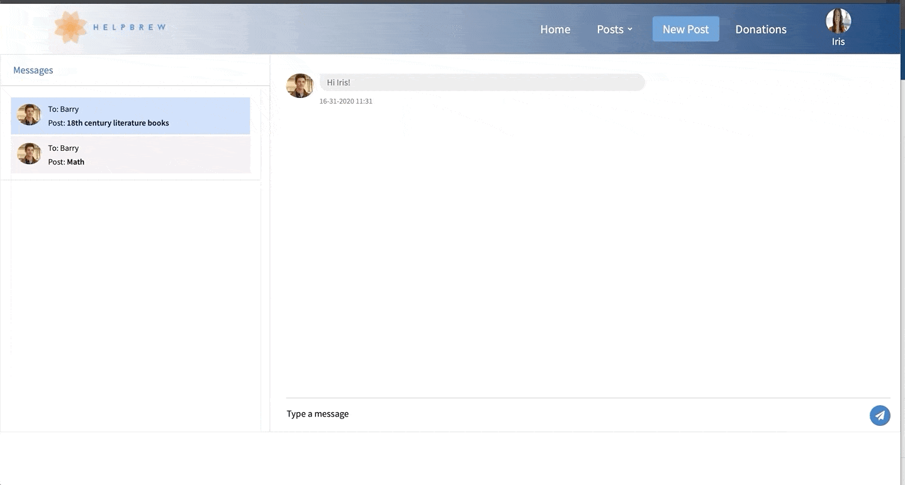

# HelpBrew

HelpBrew is a collaborative tool where a user can interact with other like minded individuals with three different kinds of services. The first is 'Skill', where a user will request or give a short tutorial of coaching session with a particular skill that they are interested in. Secondly, a user may use 'Giveaways' to give or recieve tangible materials that may aid in their learning like books, videos, software and the like. Last but not least is 'Monetary Support' where users can give or recieve information on scholarships, grants and funds and even directly request donations. 

### Building the project 

HelpBrew was built with React, Spring, CSS and HTML. 

#Using the WebApp

The user can sign up or login and after entering valid credentials will be redirected to a dashboard and a navbar, where they will have the ability to go see posts, messages and change their profile picture. 

Upon clicking on the 'New Post' button on the NavBar, the user can also make a new post from the three available categories. The user has the ability to pick whether they want to give the service or recieve it. 

Each category of post has a different functionality and feature to it. On the 'Giveaway' post, the user can specify a name of a place and they will have access to a map. Whereas on the 'Skill' post, you will get a calendar to pick a date and time.

On a 'Skill' post, should the user want to have a session with the poster, they can click on book, choose a time and date and recieve a confirmation message. If they change their mind, they can go back and unbook, and recieve yet another confirmation email.

There is also the posibility of chatting with the poster via a button on the post itself. 

### Used technologies

VS Code
IntellijIdea
Docker

  
